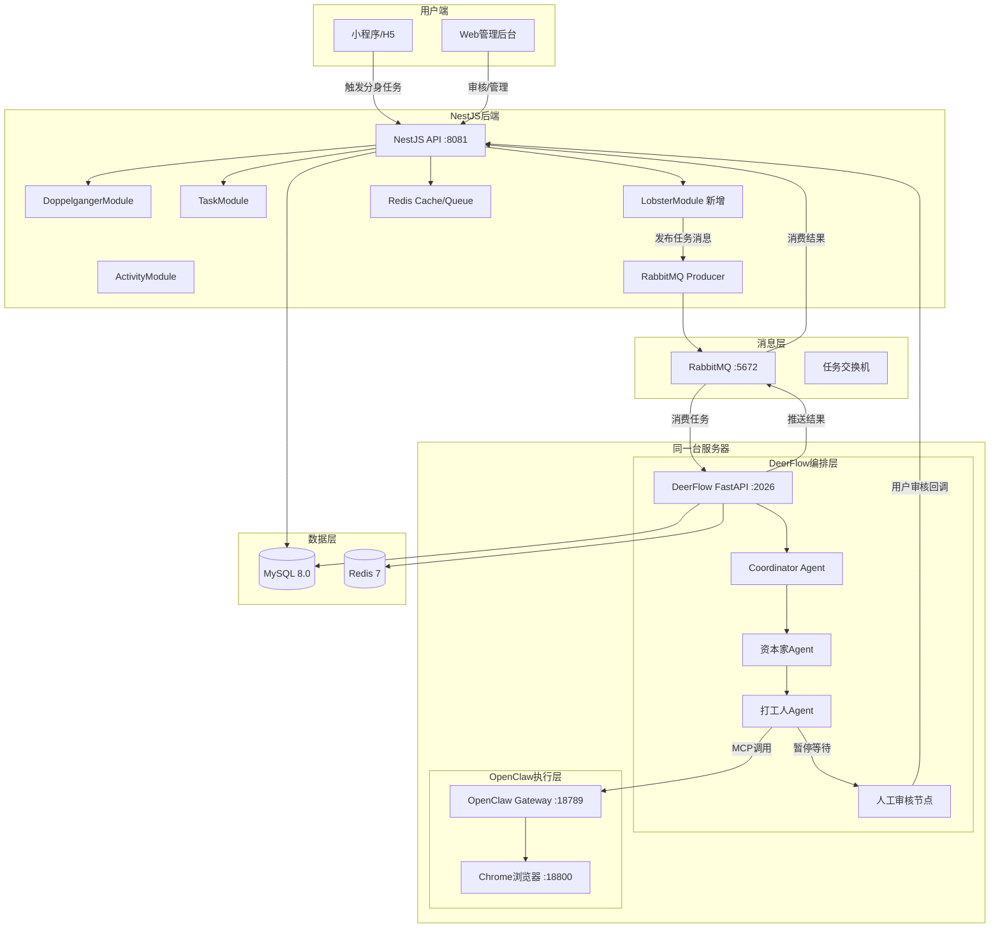

## 产品概述

将已部署的 DeerFlow（AI任务编排中控大脑）和 OpenClaw（浏览器自动化执行终端）与 NestJS 后端集成，使赛博分身（CyberDoppelganger）从当前仅有的"积分钱包"升级为具备自动化任务执行能力的系统。

## 核心功能

- **NestJS ↔ DeerFlow 双向通信**：NestJS 通过 HTTP API 触发 DeerFlow 工作流，DeerFlow 执行完成后回调 NestJS 推送结果
- **DeerFlow ↔ OpenClaw 调度链**：DeerFlow 作为编排层通过 MCP 协议调用 OpenClaw 的浏览器自动化能力执行具体任务
- **赛博分身任务执行闭环**：用户激活分身 → 每日自动执行任务 → 人工审核节点 → 结果推送 → HP/积分结算 → 偏好反馈学习
- **性格系统**：同城型/电商型/全网型三种性格对应不同 DeerFlow 任务流参数模板
- **RabbitMQ 异步消息通道**：NestJS 与 DeerFlow 之间通过消息队列解耦，支持任务分批、重试、状态追踪
- **Redis 用户队列与缓存**：按城市分批的用户队列、会话缓存、分布式锁
- **数据库模型扩展**：补充 lobster_status、lobster_task_logs、opportunities 等表及 CyberDoppelganger 性格/HP 字段

## 技术栈选择

### 现有技术栈（保持不变）

- 后端：NestJS 10 + TypeScript（端口 8081，全局前缀 api/v1）
- 数据库：MySQL 8.0 + Prisma ORM
- 基础设施：Docker Compose（MySQL/Redis/RabbitMQ/ES 均已部署）

### 新增/激活的技术组件

- **DeerFlow 2.0**：字节开源多智能体框架，FastAPI 后端，基于 LangChain + LangGraph——**已部署在同一台服务器**
- **OpenClaw**：浏览器自动化工具，MCP 协议，Python SDK（openclaw-sdk）——**已部署在同一台服务器**
- **RabbitMQ**：NestJS 侧安装 `@golevelup/nestjs-rabbitmq` 或 `amqplib`，用于与 DeerFlow 异步通信
- **Redis**：NestJS 侧安装 `@nestjs/cache-manager` + `cache-manager-redis-store`，用于用户队列/缓存/分布式锁
- **AI引擎重构**：将现有 `services/ai-engine-python` 从简单骨架重构为 NestJS ↔ DeerFlow 桥接层

### 部署拓扑

> **关键事实**：DeerFlow 和 OpenClaw 已部署在同一台服务器上，与 NestJS 后端共享同一内网。
> 
> - DeerFlow Gateway：`localhost:2026`（同机）或 `内网IP:2026`
> - DeerFlow LangGraph Server：`localhost:2024`
> - OpenClaw Gateway：`localhost:18789`（同机）或 `内网IP:18789`
> - OpenClaw Browser CDP：`localhost:18800`
> - DeerFlow ↔ OpenClaw 的 MCP 通信走 **本地 localhost**，延迟 <1ms
> - NestJS ↔ DeerFlow 的 HTTP/RabbitMQ 通信走 **内网**，延迟 <5ms
> - **不需要在 docker-compose.yml 中新增 DeerFlow/OpenClaw 容器定义**

## 实现方案

### 系统架构



### 核心数据流

**1. 触发阶段（每日 06:00 或用户手动触发）**

```
NestJS CronJob → 读取 Redis 中 L2/L3 用户队列 → 按城市分批 → 
RabbitMQ 发布任务消息(deerflow.task.trigger) → DeerFlow 消费
```

**2. 执行阶段（DeerFlow 编排）**

```
DeerFlow 收到消息 → Coordinator Agent 解析任务 → 
资本家Agent 读取用户画像(GET /api/v1/lobster/profile/:userId) → 
决定搜索方向 → 打工人Agent 调用 OpenClaw MCP 执行浏览器操作 → 
采集数据 → 质量打分 → 生成内容草稿
```

**3. 审核阶段（合规护栏）**

```
DeerFlow 暂停 → 调用 NestJS 回调(POST /api/v1/lobster/review-pending) → 
NestJS 推送微信订阅消息 → 用户在小程序/APP审核 → 
审核结果回调(POST /api/v1/lobster/review-callback) → 
NestJS 通过 RabbitMQ 通知 DeerFlow 继续
```

**4. 结算阶段**

```
DeerFlow 推送最终结果(POST /api/v1/lobster/push-result) → 
NestJS 写入 opportunities 表 → 更新 HP(+5查看/+15对接) → 
积分奖励 → 偏好反馈写入用户画像 → 写入 lobster_task_logs 审计日志
```

### API 契约设计

**NestJS → DeerFlow（通过 RabbitMQ 消息，也可 HTTP 直调）**

| 消息/接口 | 方向 | 说明 |
| --- | --- | --- |
| `deerflow.task.trigger` | NestJS → DeerFlow | 触发分身任务，payload: {userIds, personality, city, scheduledAt} |
| `deerflow.task.verify` | NestJS → DeerFlow | 人工审核结果回调，payload: {taskId, approved, feedback} |
| `deerflow.task.cancel` | NestJS → DeerFlow | 取消任务 |


**DeerFlow → NestJS（HTTP 回调 + RabbitMQ 结果推送）**

| 接口 | 方向 | 说明 |
| --- | --- | --- |
| `GET /api/v1/lobster/profile/:userId` | DeerFlow → NestJS | 获取用户画像（标签/性格/HP/偏好） |
| `POST /api/v1/lobster/review-pending` | DeerFlow → NestJS | 通知有待审核内容，触发推送 |
| `POST /api/v1/lobster/push-result` | DeerFlow → NestJS | 推送最终结果（机会/内容草稿） |
| `POST /api/v1/lobster/hp-event` | DeerFlow → NestJS | HP 变动事件（查看/对接/超时） |
| `lobster.result.push` | DeerFlow → RabbitMQ | 结果消息（供 NestJS 异步消费） |


### Prisma Schema 扩展

```
// 新增：龙虾HP状态表
model LobsterStatus {
  lobsterId            BigInt    @id @default(autoincrement()) @map("lobster_id")
  userId               BigInt    @unique @map("user_id")
  hp                   Int       @default(100) @map("hp")
  personality          String?   @map("personality") @db.VarChar(20) // city/ecommerce/global
  personalityUnlocked  Boolean   @default(false) @map("personality_unlocked")
  lobsterExpiresAt     DateTime? @map("lobster_expires_at")
  lastExecutedAt       DateTime? @map("last_executed_at")
  status               LobsterStatusEnum @default(sleeping)
  createdAt            DateTime  @default(now()) @map("created_at")
  updatedAt            DateTime  @updatedAt @map("updated_at")
  user                 User      @relation(fields: [userId], references: [userId])
  taskLogs             LobsterTaskLog[]
  hpLogs               HpLog[]

  @@map("lobster_statuses")
}

enum LobsterStatusEnum {
  sleeping    // 休眠（未订阅或过期）
  active      // 活跃（可执行任务）
  executing   // 执行中
  paused      // 暂停（等待审核）
}

// 新增：任务执行日志
model LobsterTaskLog {
  logId       BigInt   @id @default(autoincrement()) @map("log_id")
  lobsterId   BigInt   @map("lobster_id")
  taskType    String   @map("task_type") @db.VarChar(50) // daily_scan/review/push
  personality String   @map("personality") @db.VarChar(20)
  status      String   @db.VarChar(20) // running/paused/completed/failed
  inputJson   Json?    @map("input_json")
  outputJson  Json?    @map("output_json")
  deerflowRunId String? @map("deerflow_run_id") @db.VarChar(100)
  startedAt   DateTime @map("started_at")
  completedAt DateTime? @map("completed_at")
  lobster     LobsterStatus @relation(fields: [lobsterId], references: [lobsterId])

  @@index([lobsterId, startedAt])
  @@map("lobster_task_logs")
}

// 新增：HP变动记录
model HpLog {
  logId     BigInt   @id @default(autoincrement()) @map("log_id")
  lobsterId BigInt   @map("lobster_id")
  delta     Int      // 正数增加，负数减少
  reason    String   @db.VarChar(50) // daily_deduct/view_bonus/match_bonus/system_adjust
  refId     BigInt?  @map("ref_id") // 关联的任务/匹配ID
  createdAt DateTime @default(now()) @map("created_at")
  lobster   LobsterStatus @relation(fields: [lobsterId], references: [lobsterId])

  @@index([lobsterId, createdAt])
  @@map("hp_logs")
}

// 新增：发现的机会
model Opportunity {
  opportunityId BigInt   @id @default(autoincrement()) @map("opportunity_id")
  userId        BigInt   @map("user_id")
  sourceType    String   @map("source_type") @db.VarChar(30) // 1688/xiaohongshu/local_affiliate
  title         String   @db.VarChar(200)
  content       String?  @db.Text
  priceRange    Json?    @map("price_range")
  commission    Decimal? @db.Decimal(10, 2)
  sourceUrl     String?  @map("source_url") @db.VarChar(500)
  status        OpportunityStatus @default(pending_review)
  taskLogId     BigInt?  @map("task_log_id")
  createdAt     DateTime @default(now()) @map("created_at")
  reviewedAt    DateTime? @map("reviewed_at")

  @@index([userId, status])
  @@map("opportunities")
}

enum OpportunityStatus {
  pending_review
  approved
  rejected
  expired
  claimed
}

// User 模型补充字段
// + lobster LobsterStatus?
```

### 模块设计

**1. LobsterModule（新建）** — 龙虾分身核心模块

- `lobster.controller.ts`：暴露 DeerFlow 回调端点 + 用户端分身操作端点
- `lobster.service.ts`：HP引擎、性格管理、任务触发、结果接收、偏好学习
- `lobster.scheduler.ts`：每日 06:00 定时触发任务（@nestjs/schedule）
- `lobster.producer.ts`：RabbitMQ 消息生产者
- `lobster.consumer.ts`：RabbitMQ 消息消费者（接收 DeerFlow 结果推送）
- `dto/`：请求校验 DTO

**2. DoppelgangerModule（扩展）** — 保持积分功能，与 LobsterModule 协作

- 积分奖励通过事件机制与 LobsterModule 的 HP 变动联动

**3. AI Engine Python 服务（重构）** — 从骨架重构为桥接层

- 新增 `deerflow_client.py`：封装 DeerFlow REST API 调用
- 新增 `openclaw_skill.py`：DeerFlow Skill 定义（MCP 调用 OpenClaw）
- 新增 `lobster_workflow.yaml`：DeerFlow 工作流配置文件
- 重构 `scheduler.py`：对接 NestJS 的触发指令而非自行调度
- 重构 `config.py`：修正 `OPENCLAW_BASE_URL` 和新增 `DEERFLOW_BASE_URL`

## 实现注意事项

### 性能

- RabbitMQ 消息批量发布时使用 confirm 模式确保可靠投递
- DeerFlow 回调 NestJS 时需处理网络抖动：实现幂等性（基于 taskId 去重）+ 指数退避重试
- Redis 用户队列按城市分组，每批 50 人，避免 DeerFlow 单次负载过高
- HP 日扣减操作使用 Redis 分布式锁防并发，与现有 DoppelgangerService 的行锁策略一致

### 安全与合规

- DeerFlow → NestJS 回调必须带 HMAC 签名验证，防止伪造推送
- 所有 AI 生成内容必须标注"AI辅助生成，仅供参考"
- 人工审核节点 `skip_allowed: false`，72 小时超时自动标记为"未审核"
- 用户联系方式仍使用虚拟中继邮箱，DeerFlow 不可获取真实联系方式

### 日志与审计

- lobster_task_logs 记录每次执行的完整输入输出，包括 deerflowRunId 用于链路追踪
- hp_logs 记录每次 HP 变动的原因和关联 ID，确保审计完整性

### 向后兼容

- CyberDoppelganger 原有积分功能保持不变，LobsterStatus 是新增的独立模型
- DoppelgangerService 现有接口（addPoints/consumePoints）不修改，LobsterModule 通过事件机制触发积分变动
- 现有 TaskModule 的手动任务流程保持不变，LobsterModule 的自动化任务是并行的新通道

## 目录结构

```
Busy-as-a-shrimp/
├── apps/api/src/modules/
│   ├── doppelganger/              # [保持] 积分钱包，不变
│   ├── task/                      # [保持] 手动任务大厅，不变
│   ├── lobster/                   # [新建] 龙虾分身自动化任务模块
│   │   ├── lobster.module.ts      # [NEW] 模块定义，注册 providers/controllers/imports
│   │   ├── lobster.controller.ts  # [NEW] 用户端+DeerFlow回调端点
│   │   ├── lobster.service.ts     # [NEW] HP引擎/性格管理/任务触发/结果接收
│   │   ├── lobster.scheduler.ts   # [NEW] 每日定时触发任务
│   │   ├── lobster.producer.ts    # [NEW] RabbitMQ消息生产者
│   │   ├── lobster.consumer.ts    # [NEW] RabbitMQ消息消费者
│   │   └── dto/                   # [NEW] 请求校验DTO
│   │       ├── trigger-task.dto.ts
│   │       ├── review-callback.dto.ts
│   │       └── push-result.dto.ts
│   └── common/
│       └── rabbitmq.module.ts     # [NEW] RabbitMQ全局连接模块
│
├── packages/database/prisma/
│   └── schema.prisma              # [MODIFY] 新增LobsterStatus/LobsterTaskLog/HpLog/Opportunity模型及枚举
│
├── services/ai-engine-python/     # [重构] 从骨架重构为NestJS↔DeerFlow桥接层
│   ├── app/
│   │   ├── config.py              # [MODIFY] 新增DEERFLOW_BASE_URL，修正OPENCLAW_BASE_URL
│   │   ├── main.py                # [MODIFY] 新增DeerFlow交互端点
│   │   ├── deerflow_client.py     # [NEW] DeerFlow REST API封装
│   │   ├── openclaw_skill.py      # [NEW] OpenClaw MCP Skill定义
│   │   ├── lobster_workflow.py    # [NEW] 龙虾每日工作流定义
│   │   ├── scheduler.py           # [MODIFY] 改为监听RabbitMQ触发
│   │   ├── matcher.py             # [保持] 匹配算法
│   │   ├── models.py              # [MODIFY] 新增LobsterStatus等SQLAlchemy模型
│   │   └── database.py            # [保持]
│   ├── workflows/                 # [NEW] DeerFlow工作流YAML配置
│   │   ├── lobster_daily_master.yaml
│   │   ├── lobster_city_sub.yaml
│   │   ├── lobster_ecommerce_sub.yaml
│   │   └── lobster_global_sub.yaml
│   └── pyproject.toml             # [MODIFY] 新增openclaw-sdk, pika等依赖
│
├── docker-compose.yml             # [保持] DeerFlow和OpenClaw已在同一服务器部署，无需新增容器
│
└── .env.example                   # [MODIFY] 新增DEERFLOW_BASE_URL(localhost:2026), OPENCLAW_BASE_URL(localhost:18789), DEERFLOW_API_KEY等
```

本任务不涉及新建 UI，而是后端架构集成。但后续前端需要新增以下页面/组件来配合赛博分身功能：

- 分身控制台页面：展示 HP 状态、性格选择、任务执行历史、审核待办
- 审核弹窗组件：接收 DeerFlow 推送的待审核内容，用户一键通过/拒绝
- 分身结果列表：展示每日发现的机会/内容草稿

设计风格延续现有管理后台的深色专业风格，分身状态用赛博朋克风格的霓虹色（青色#00F5D4作为活跃状态、紫色#9B5DE5作为执行中状态）来体现赛博分身的科技感。

## Agent Extensions

### Skill

- **code-explorer**: 用于在实现阶段深入查看现有模块的具体实现细节（如 DoppelgangerService 的事务模式、AdminModule 的审核流程），确保新代码遵循项目既有约定

### SubAgent

- **code-explorer**: 在实现各个模块时，快速定位依赖关系和调用链路，避免遗漏关键集成点